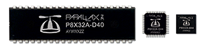

# Propeller Developer Site
Resources for the Propeller developer community; gathered and served on [GitHub](https://github.com/parallaxinc/propeller/).

Not familiar with the Propeller?  Read an [overview of the Propeller Microcontroller](https://www.parallax.com/microcontrollers/propeller)

## Object Exchange
The object exchange is a collection of community and Parallax developed source code objects for the Propeller, also known as libraries.  They are free to use under the MIT license.  
  * [Explore the P1 Object Exchange](https://github.com/parallaxinc/propeller/tree/master/libraries/community/p1)
  * [Explore the P2 Object Exchange](https://github.com/parallaxinc/propeller/tree/master/libraries/community/p2)

## [Propeller 1 (P1 or P8X32A)](p1.md)
A multicore microcontroller released in Q1 2006.

## [Propeller 2 (P2 or P2X8C4M64P)](p2.md)
An advanced multicore microcontroller in active development; projected general release Q4 2020.

&nbsp;&nbsp;&nbsp;&nbsp;

