# Propeller&nbsp;2 (P2&nbsp;or&nbsp;P2X8C4M64P)

[Social](#social-media) | [Object&nbsp;Exchange](#p2-object-exchange) | [Documentation](#documentation) | [Hardware](#hardware) | [Software](#software) | [Firmware](#firmware) | [Recent&nbsp;Activity](#recent-activity)

---------------------------------------------------------------------------------------------

[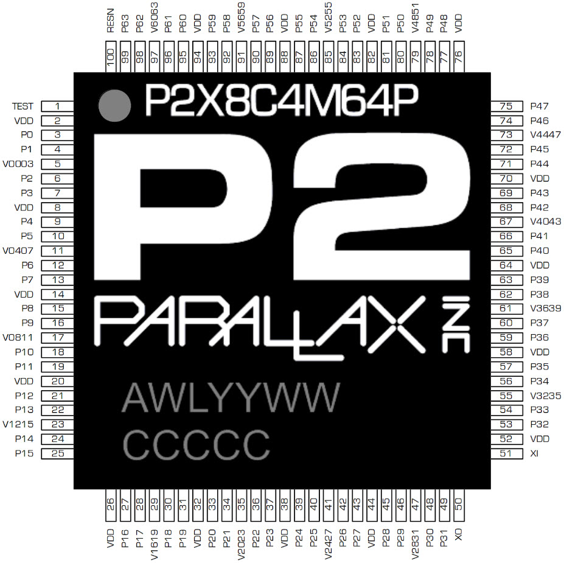](assets/p2_pinout_large.jpg)&nbsp;&nbsp;&nbsp;&nbsp;[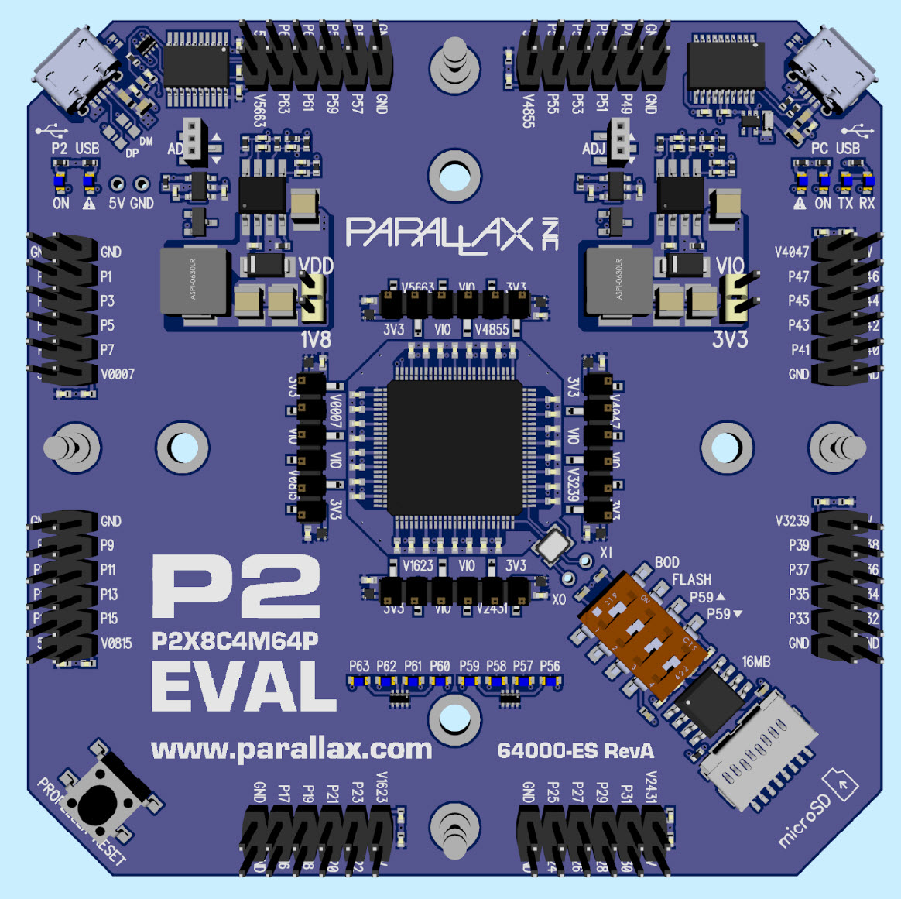](assets/p2-es_rev_a.jpg)

##### _Returning visitor?  See [Recent Activity](#recent-activity)_

---------------------------------------------------------------------------------------------

## Social Media

### Propeller 2 Live Forums
Early Adopter Series - Presentations and discussion around programming tools, languages, hardware, applications, code examples, and projects of all kinds.  Learn, lurk, and ask questions.
  * Watch recorded sessions:

|[Testing Hardware with TAQOZ in ROM][P2F1]|[Display, GUI, and Multimedia Options][P2F2]|[FastSpin Multi-language Development][P2F3]|
|------------------------------------------|--------------------------------------------|-------------------------------------------|
|  [Peter Jakacki and Ray Rodrick][P2F1]   |      [Raymond Allen, PhD EE][P2F2]         |           [Eric R. Smith][P2F3]           |
|[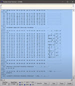][P2F1]|[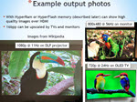][P2F2]|[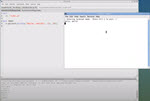][P2F3]|
|[Chat Log](assets/Presentations/P2F1_ChatLog.txt)|[Presentation Slide Deck (PDF)](https://github.com/parallaxinc/propeller/releases/download/P2_Live_2/Display.GUI.and.Multimedia.options.with.P2.rev.b.pdf)|[Presentation Slide Deck (PDF)](https://github.com/parallaxinc/propeller/releases/download/P2_Live_3/Multi-language.Programming.on.the.P2.with.fastspin.and.FlexGUI.pdf)|
||[Chat Log](assets/Presentations/P2F2_ChatLog.txt)|[Chat Log](assets/Presentations/P2F3_ChatLog.txt)|

---

|[Visual Programming with Touch Logic Control][P2F4]|[Spin2/PASM2 Debug with Runtime Expression][P2F5]|[MicroPython for the P2][P2F6]|
|---------------------------------------------------|-------------------------------------------------|------------------------------|
|              [James Caska][P2F4]                  |           [Chip Gracey][P2F5]                   |[Tubular and OzPropDev][P2F6] |
|[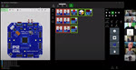][P2F4]|[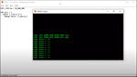][P2F5]|[][P2F6]|
|[Virtual Breadboard website](http://www.virtualbreadboard.com/)|[PNut v34ua (required for debugging)][PNutV34ua]|[Chat Log](assets/Presentations/P2F6_ChatLog.txt)|
||See DEBUG info in [P2 Spin2 Documentation](https://docs.google.com/document/d/16qVkmA6Co5fUNKJHF6pBfGfDupuRwDtf-wyieh_fbqw/edit?usp=sharing)||
||[Chat Log](assets/Presentations/P2F5_ChatLog.txt)||

[P2F1]: https://www.youtube.com/watch?v=DfDaXcbk-dY&list=PLt_MJJ1F_EXa25_TWa4Sdi77daQaxA_ZU&index=2&t=0s "Testing Hardware with TAQOZ in ROM - Peter Jakacki and Ray Rodrick - June 18"
[P2F2]: https://www.youtube.com/watch?v=wmzQY6SayQE&list=PLt_MJJ1F_EXa25_TWa4Sdi77daQaxA_ZU&index=3&t=0s "Display, GUI, and Multimedia Options with the Propeller 2 - Raymond Allen, PhD EE - June 24"
[P2F3]: https://www.youtube.com/watch?v=M8OYUDcgV_8&list=PLt_MJJ1F_EXa25_TWa4Sdi77daQaxA_ZU&index=4&t=0s "Multi-language Development with fastspin/flexgui - Eric R. Smith - July 01"
[P2F4]: https://youtu.be/b772b8cZnLg?list=PLt_MJJ1F_EXa25_TWa4Sdi77daQaxA_ZU&t=20 "Visual Programming with Touch Logic Control (TLC) and TAQOZ - James Caska - July 08"
[P2F5]: https://youtu.be/uywWA1Sk1L0?list=PLt_MJJ1F_EXa25_TWa4Sdi77daQaxA_ZU&t=40 "Spin2/PASM2 Debug with Runtime Expression Reporting - Chip Gracey - July 15"
[P2F6]: https://youtu.be/6UTC4h860A8?list=PLt_MJJ1F_EXa25_TWa4Sdi77daQaxA_ZU&t=4 "TeamOz Presents MicroPython for the P2 - Tubular and OzPropDev - July 22"

  * Next on schedule: 
    * Propeller Tool and Wi-Fi Adapter for P2 Eval - Jeff Martin & Michael Mulholland - Sep 2nd
    * _Want to present?_  Simply go to this [Google document page](https://docs.google.com/document/d/1gd-lMYSFRRbU-L63HWtdo7HVjPkDWDTY_YT3xq3cp6g/edit?usp=sharing) and sign up to be a presenter. [Read more on the forum.](http://forums.parallax.com/discussion/171704/propeller-2-live-forum-early-adopter-series-topics-speakers-and-registration)

### P2 Community Newsletter
[Join the P2 Community Newsletter](https://us19.campaign-archive.com/home/?u=0234d4a511fd7724a797df3d3&id=7e689d90fe) and [Follow Parallax Social Sites](https://www.parallax.com/company/follow-us).

Previous newsletters:
  * [July 21, 2020](http://eepurl.com/g-WDuL): Team Oz Presents "MicroPython with the P2"
  * [July 12, 2020](http://eepurl.com/g92EkX): Propeller 2 Live Forum - Chip Gracey presents "Spin 2 Debug with Runtime Expression Reporting"
  * [July 7, 2020](http://eepurl.com/g9GLcv): Propeller 2 Live Forum - Early Adopters Meeting on Wednesday + Evaluation Board Update
  * [June 30, 2020](http://eepurl.com/g8Oqvz): Invitation to Propeller 2 Live Forum - Eric Smith's FlexGUI, P2ES Rev C pre-order, Propeller Tool, and new Spin2 objects
  * [June 23, 2020](http://eepurl.com/g8gfV1): Display, GUI and Multimedia Options with the Propeller 2
  * [June 14, 2020](http://eepurl.com/g6YbdH): Propeller 2 Live Forums - Early Adopter Series First Zoom, Propeller Tool 2nd Alpha, and TeamOz's MicroPython
  * [June 8, 2020](http://eepurl.com/g6xL2T): Propeller Tool Alpha Release for Windows Supports P2X8C4M64P (P2)
  * [June 3, 2020](http://eepurl.com/g5YO-z): 7,000 P2X8C4M64P-ES Revision C Chips Arrived at Parallax
  * [March 23, 2020](http://eepurl.com/gXawe1): Propeller 2 Revision C (P2X8C4M64P-ES) Schedule and COVID-19
  * [December 30, 2019](http://eepurl.com/gOlEff): “Chat with Chip” Webinar follow-up, survey of P2 language interests, white paper by Richard Morrison, update on P2 Evaluation Boards
  * [December 14, 2019](http://eepurl.com/gMZ8_L): How to order trays of P2 chips, preliminary pricing, “Chat with Chip” webinar registration
  * [January 25, 2019](http://eepurl.com/ge2nuT): P2 evaluation board add-ons available.

### Videos & Articles
  * [View the "Chat with Chip About P2" Webinar](https://www.youtube.com/watch?v=vjvMqgIm27o) - 12/18/2019 - in this informal-style webinar, Chip demonstrates some P2 capabilities and answers many attendee questions along the way
    * 
  * [Read "Evaluating the Parallax Propeller P2 Chip" by Richard J. S. Morrison](https://github.com/parallaxinc/propeller/raw/master/resources/Articles/P2-EVALB_Evaluation.pdf) - 12/16/2019 - an exploration of the P2's unique capabilities and extensive, powerful instruction set
    * [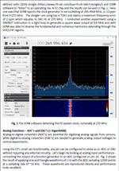](https://github.com/parallaxinc/propeller/raw/master/resources/Articles/P2-EVALB_Evaluation.pdf)
  * Terry's Workbench
    * [Unboxing P2 Engineering Sample Rev B](https://youtu.be/pl6X5kdjr4M?t=264) - Nov 2019
      * 
    * P2 OLED Videos
      * &nbsp;&nbsp;&nbsp;[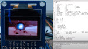](https://youtu.be/J7CsMfeDLLE)&nbsp;&nbsp;&nbsp;[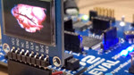](https://youtu.be/ja84rf38QHM)&nbsp;&nbsp;&nbsp;[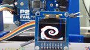](https://youtu.be/7PWBvkrvhGI)
    * [Unboxing P2 Engineering Sample Part 1](https://youtu.be/wldcUYIfQ0c?t=56) - Apr 2019
    * [Unboxing P2 Engineering Sample Part 2](https://youtu.be/ekMWIPFruek) - Apr 2019

### P2 Forum
  * View or join the discussions in the [Propeller 2 Forum](http://forums.parallax.com/categories/propeller-2-multicore-microcontroller)

## P2 Object Exchange
The object exchange is a collection of community and Parallax developed source code objects for the Propeller, also known as libraries.  They are free to use under the MIT license.  
  * [Explore the P2 Object Exchange](https://github.com/parallaxinc/propeller/tree/master/libraries/community/p2)

###### Want to share your objects?  [Here's how to contribute.](https://github.com/parallaxinc/propeller/wiki/Contributing)  Want to create objects we're asking the community for?  [See our P2 Object thread](http://forums.parallax.com/discussion/171771/propeller-2-objects-a-process-to-involve-community-and-share-code) for details.

## Documentation
  * Rev B/C Silicon (v33 - 08/2019-LPD1941 & 06/2020-LHU2019)
    * [Propeller 2 Rev B/C Silicon Documentation](https://docs.google.com/document/d/1gn6oaT5Ib7CytvlZHacmrSbVBJsD9t_-kmvjd7nUR6o/edit?usp=sharing) is contained in a Google Doc with community commenting enabled
    * [Propeller 2 Rev B/C PASM Instructions](https://docs.google.com/spreadsheets/d/1_vJk-Ad569UMwgXTKTdfJkHYHpc1rZwxB-DcIiAZNdk/edit?usp=sharing) are contained in a Google Spreadsheet
    * [Propeller 2 Rev B/C Spin 2 Language Documentation][P2SpinDoc] is contained in a Google Doc with community commenting enabled
  * Rev A Silicon (v32 - 09/2018 - LWB1843)
    * Propeller 2 [Rev A Documentation](https://docs.google.com/document/d/1UnelI6fpVPHFISQ9vpLzOVa8oUghxpI6UpkXVsYgBEQ/edit?usp=sharing) and [Rev A PASM Instructions](https://docs.google.com/spreadsheets/d/1usUcCCQVp3liAqENX9rvX-XVqJomMREhKYExM_taG0A/edit?usp=sharing)
  * [TAQOZ ROM-resident Interactive Prompt](https://goo.gl/znBdQw) documentation, by Peter Jakacki

## Hardware
Propeller 2 early adopters may experiment with two options: 1) limited-edition boards and silicon engineering samples (below) or, 2) design emulation on supported FPGAs (following).

### Parallax Boards and Silicon
*On the following product pages, expand the Downloads and Additional Resources tabs for documentation, schematics, and more.*
  * [Propeller 2 Products](https://www.parallax.com/product/propeller-2) - All P2-related products
  * [P2-ES Eval Board](https://www.parallax.com/product/64000-es) - For experimentation with the P2 engineering samples (2nd release, Rev B silicon)
    - [Rev C Documentation](https://www.google.com/url?q=https://docs.google.com/document/d/15FXvm2-2GxBi8XHcfKeDlXznptRxweGQ6upv5ITP_OA/edit?usp%3Dsharing&sa=D&source=hangouts&ust=1593537821644000&usg=AFQjCNFeaEFRf9SAP8DoVVviukl1_yc-yQ)
    - [Support](http://forums.parallax.com/discussion/169367/p2-es-board-support/p1)
  * [HyperRAM](https://www.parallax.com/product/64004-es) - Limited edition, 16 MB HyperRAM + 32 MB HyperFlash add-on board for P2-ES
  * [Protoboard](https://www.parallax.com/product/64005-es) - Prototyping board for P2-ES to create custom circuitry with the Propeller 2 microcontroller
  * [P2-ES Accessory Set](https://www.parallax.com/product/64006-es) - Eight accessory boards in one kit - for the P2-ES board
    * (a) Control - four pushbuttons and four LEDs
    * (b) Serial Host - twin USB type A sockets
    * (c) LED Matrix - a 8x7 grid of green LEDs for Charlieplexing
    * (d) Digital Video Out - HDMI-type connector
    * (e) Mini Prototyping - 8x12 grid of plated thru-holes with labled power and I/O
    * (f) Serial Device - two microUSB type sockets with individual activity LEDs
    * (g) Goertzel - a set of non-contact position sensing pads
    * (h) A/V Breakout - 3.5mm Audio in/out, four RCA audio/video, VGA

### FPGA emulation
  * [Propeller 2 Version 33k Verilog File](https://github.com/parallaxinc/propeller/releases/download/v33k/Prop2_FPGA_v33k.zip) - For P2 Rev B emulation on an FPGA board
    * [Propeller 2 Version 32i Verilog File](https://github.com/parallaxinc/propeller/releases/download/v32i/Prop2_FPGA_v32i.zip) - For P2 Rev A emulation on an FPGA board
  * [Detailed information](http://forums.parallax.com/discussion/162298/prop2-fpga-files-updated-2-june-2018-final-version-32i/p1) is on the forum
  * [P2 FPGA Emulation](http://forums.parallax.com/discussion/144199/propeller-ii-emulation-of-the-p2-on-fpga-boards-prop123-a7-a9-de0-nano-de2-115-etc#latest) discussion

## Software
  * ### IDEs
    - Propeller Tool - Parallax P1 & P2 IDE (built for Windows)
      - [Propeller Tool v2.2.0.0 Alpha (06/17/20)](https://www.parallax.com/downloads/propeller-tool-software-windows-spin-assembly) - for P2 Rev B/C (2nd/3rd -ES silicon) [3rd is slated as production version] as used on the Rev B and Rev C P2 Eval boards
    - PNut - Parallax P2 IDE (built for Windows- can be used with wine on Linux and MacOS)
      - [PNut v34ua][PNutV34ua] - for P2 Rev B/C (2nd/3rd ES silicon) [3rd is slated as production version] as used on the Rev C P2 Eval boards.  Supports debugging.  See [P2 Spin2 Launguage][P2SpinDoc] documentation's DEBUG details
      - [PNut v34ta](https://github.com/parallaxinc/propeller/releases/download/PNut_v34ta/PNut_v34ta.zip) - for P2 Rev B/C (2nd/3rd ES silicon) [3rd is slated as production version] as used on the Rev C P2 Eval boards.  Supports debugging.  See [P2 Spin2 Launguage][P2SpinDoc] documentation's DEBUG details
      - [PNut v32i](https://github.com/parallaxinc/propeller/releases/download/v32i/PNut_v32i.exe) - for P2 Rev A (1st -ES silicon, as used on the Rev A P2 Eval boards)
    - [FlexGUI (formerly Spin2gui)](https://github.com/totalspectrum/flexgui/releases) - IDE for P1 and P2 [Spin](https://github.com/totalspectrum/spin2cpp/blob/master/doc/spin.md),
[BASIC](https://github.com/totalspectrum/spin2cpp/blob/master/doc/basic.md) and
[C](https://github.com/totalspectrum/spin2cpp/blob/master/doc/c.md) by Eric R. Smith
      - See [FlexGUI source readme](https://github.com/totalspectrum/flexgui/blob/master/README.md) for documentation
    - [SpinEdit](https://forums.parallax.com/discussion/download/129426/SpinEdit_25Apr20.zip) - IDE for P1 and P2 Spin, Spin2, and FastBasic by Rayman
      - See [SpinEdit forum post](https://forums.parallax.com/discussion/169259/spinedit-editor-for-spin-spin2-and-fastbasic) for more information

  * ### Language Tools (Compiler & Interpreter)
    - [fastspin](https://github.com/totalspectrum/spin2cpp/releases) -
P1 and P2 Spin, BASIC and C compiler by Eric R. Smith
    - [P1 Spin interpreter for P2](https://forums.parallax.com/discussion/169861/p1-spin-interpreter-for-p2) -
by cluso99
    - [P1 Spin interpreter for P2](https://forums.parallax.com/discussion/162858/p1spin) -
by Dave Hein
    - [p2gcc, p2asm & loadp2](https://github.com/davehein/p2gcc) - P2 C compiler/assembler/linker/loader by Dave Hein
    - [Catalina](https://forums.parallax.com/discussion/168399/catalina-and-the-p2) - P1 and P2 C Compiler/linker by Ross Higson
    - [MicroPython](https://forums.parallax.com/discussion/169862/micropython-for-p2) - P2 microPython implementation by Eric R. Smith
    - [pyLoader](https://forums.parallax.com/discussion/168850/python-p2-loader) - P2 binary loader written in python by ozpropdev

  * ### [More Software and Examples](software.md)

## Firmware
  * [boot rom P2 v33k](https://github.com/parallaxinc/propeller/blob/master/resources/FPGA%20Examples/ROM_Booter_v33k.spin2) - Boot ROM for [P2 Rev B](https://forums.parallax.com/discussion/169282/list-of-changes-in-next-p2-silicon) as available on P2-ES Rev B
    - [boot rom P2 v32i](https://github.com/parallaxinc/propeller/blob/master/resources/FPGA%20Examples/ROM_Booter_v32i.spin2) - Boot ROM for P2 Rev A as available on P2-ES Rev A board
  * [TAQOZ discussion](https://forums.parallax.com/discussion/167868/taqoz-tachyon-forth-for-the-p2-boot-rom) - treasure trove of information on TAQOZ by Peter Jakacki

## Other
  * [P2 example](https://github.com/parallaxinc/propeller/tree/master/resources) source code and articles

## Recent Activity
##### _Full details [here](https://github.com/parallaxinc/propeller/pulls?q=is%3Aclosed)._

* Added Jon "JonnyMac" McPhalen's object [sircs tx](https://github.com/parallaxinc/propeller/tree/master/libraries/community/p2/All/jm_sircs_tx) (Sony SIRCS protocol transmitter)
* Included [July 21st's newsletter](https://propeller.parallax.com/p2.html#p2-community-newsletter)
* Added [PNut v34ua](https://propeller.parallax.com/p2.html#ides).
* Added Jon "JonnyMac" McPhalen's objects
  * [sircs rx](https://github.com/parallaxinc/propeller/tree/master/libraries/community/p2/All/jm_sircs_rx) (Sony SIRCS protocol receiver)
  * [dmx tx](https://github.com/parallaxinc/propeller/tree/master/libraries/community/p2/All/jm_dmx_tx) (DMX 512 protocol)
* Added [PNut v34ta](https://propeller.parallax.com/p2.html#ides).
* Added Jon "JonnyMac" McPhalen's object [pwm](https://github.com/parallaxinc/propeller/tree/master/libraries/community/p2/All/jm_pwm) (pulse-width modulation generator)
* Included [July 7th's newsletter](https://propeller.parallax.com/p2.html#p2-community-newsletter)
* Added Nicolas Benezan's [Simple SPI Flash](https://github.com/parallaxinc/propeller/tree/master/libraries/community/p2/All/Simple_SpiFlash)  object (Simple SPI Flash)
* Added Jon "JonnyMac" McPhalen's objects
  * [dc motor](https://github.com/parallaxinc/propeller/tree/master/libraries/community/p2/All/jm_dc_motor) (DC Motor controller)
  * [1-wire](https://github.com/parallaxinc/propeller/tree/master/libraries/community/p2/All/jm_1-wire) (1-wire protocol)
* Included P2 Object request thread in the [Object Exchange section](https://propeller.parallax.com/p2.html#p2-object-exchange).
* Added P2 Forum #3 recorded session and slides: [Multi-language Development with fastspin/flexgui](https://propeller.parallax.com/p2.html#propeller-2-live-forums) 
* Added Jon "JonnyMac" McPhalen's object
  * [max7219_ez](https://github.com/parallaxinc/propeller/tree/master/libraries/community/p2/All/jm_ez_max7219) (8-digit, 7-segment LED controller)
  * [lcd_pcf8574](https://github.com/parallaxinc/propeller/tree/master/libraries/community/p2/All/jm_lcd_pcf8574) (LCD control via I2C)
  * [i2c](https://github.com/parallaxinc/propeller/tree/master/libraries/community/p2/All/jm_i2c) (I2C protocol)
  * [servo](https://github.com/parallaxinc/propeller/tree/master/libraries/community/p2/All/jm_servo) (Servo control)
  * [ez_analog](https://github.com/parallaxinc/propeller/tree/master/libraries/community/p2/All/jm_ez_analog) (Analog Input)
  * [ez_sound](https://github.com/parallaxinc/propeller/tree/master/libraries/community/p2/All/jm_ez_sound) (Create tones and musical notes)
  * [quadrature](https://github.com/parallaxinc/propeller/tree/master/libraries/community/p2/All/jm_quadrature) (Quadrature Encoder)
  * [ez_button](https://github.com/parallaxinc/propeller/tree/master/libraries/community/p2/All/jm_ez_button) (I/O configuring for a button or switch)
* Added [P2ES Rev C documentation](https://propeller.parallax.com/p2.html#parallax-boards-and-silicon).
* Added [Terry's Workbench videos](https://propeller.parallax.com/p2.html#videos--articles)
* Replaced/Updated Jon "JonnyMac" McPhalen's objects
  * [prng](https://github.com/parallaxinc/propeller/tree/master/libraries/community/p2/All/jm_prng) (Pseudo-Random and Random Number Generator)
  * [serial](https://github.com/parallaxinc/propeller/tree/master/libraries/community/p2/All/jm_serial) (True-most, unbuffered serial coms using smart pins
  * [p2es_matrix](https://github.com/parallaxinc/propeller/tree/master/libraries/community/p2/All/jm_p2es_matrix) (P2ES Matrix accessory persistent display)
  * [p2es_control](https://github.com/parallaxinc/propeller/tree/master/libraries/community/p2/All/jm_p2es_control) (P2ES Control accessory)
* Added Rayman's [SpinEdit IDE](#ides)
* Added Johannes Ahle's [reSound](https://github.com/parallaxinc/propeller/tree/master/libraries/community/p2/All/reSound) audio driver
* Updated references to [Park Transformation](https://github.com/parallaxinc/propeller/tree/master/libraries/community/p2/All/ParkTransformation) object

[P2SpinDoc]: https://docs.google.com/document/d/16qVkmA6Co5fUNKJHF6pBfGfDupuRwDtf-wyieh_fbqw/edit "P2 Spin2 Language Doc"
[PNutV34ua]: https://github.com/parallaxinc/propeller/releases/download/PNut_v34ua/PNut_v34ua.zip "PNut v34ua"