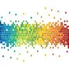

# 160 x 120 6 Bits Per Pixel VGA Driver

By: Kwabena W. Agyeman

Language: Spin, Assembly

Created: Nov 18, 2010

Modified: January 26, 2018

A 160 x 120 6 Bits Per Pixel VGA driver that runs on one cog. The code has been fully optimized with a super simple spin interface for maximum speed and is also fully commented.

Provides full support for:

*   Plotting pixels in spin. Each pixel has 6 bit color.
*   Plotting boxes of pixels in spin. Each boxes of pixels has 6 bit color.

This list of features is not comprehensive. Please download the source code and run the included demo to gain a better understanding of this driver.
