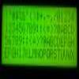

# 3 I/O Pin Hitatchi compatible LCD driver

By: frank freedman

Language: Spin

Created: Jul 17, 2011

Modified: June 17, 2013

My initial hack at interfacing a Power Tip PC2004LRF LCD display to the prop chip. Uses only 3 I/O lines; clock, data, E. 

The three methods in the object are 1) init the display, 2) send commands to the LCD, and 3) send data to be displayed. To display data, requires sending either sequential data or an address command then a data out. See the test fixture included here.

This is one dot oh, feel free to use, abuse, or improve it. Any feedback is welcomed, whether heeded shall remain open.

Made schematic correction to show MR\* pulled up to +5V
