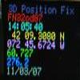

# 3DfixOLED

By: W1AUV

Language: Spin

Created: Sep 3, 2008

Modified: June 17, 2013

For Amateur Radio enthusiasts working with Microwaves and GPS stabilized oscillators I produced two chips for 3Dfix detection and display of other GPS parameters. The first thing I did when I got a 4D Systems oLED module was to re-write 3Dfix for the Propeller. It was my first stab at SPIN too. It works pretty well but of course you could easily modify it to suit your own needs. The text is a little small for my old eyes but I really like the size! It also displays 8 digit Maidenhead.
