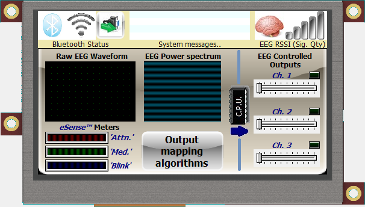

# 4D systems uLCD-xx,uLCD-xxPT & uLCD-xxPCT VisiGenie framework

By: Mathew Brown

Language: Spin

Created: Mar 8, 2014

Modified: March 9, 2014

Simple client framework for using  4D systems uLCD-xx "non touchscreen"  & uLCD-xxPT, uLCD-xxPCT "touchscreen"  
Intelegent LCD modules in VisiGenie  host mode.

Has method dependencies & calls to FullDuplexSerial, for host comms to LCD. Requiring 1 cog for serial driver.

All method calls for display access  are blocking routines, pending reply from LCD module.

Non blocking version (using message queues + 1 helper cog), which also handles animating user images,

and handling async 'thrown' events to be shortly released on OBEX.

