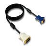

# 640 x 480 VGA Tile Map Driver w/ Mouse Cursor

By: Kwabena W. Agyeman

Language: Spin, Assembly

Created: Aug 4, 2010

Modified: June 17, 2013

A 640 x 480 VGA tile map driver with a mouse cursor that runs on one cog. The code has been fully optimized with a super simple spin interface for maximum speed and is also fully commented.

Provides full support for:

*   Scrolling arbitrary portions of the screen up,
*   Scrolling arbitrary portions of the screen down,
*   Displaying flat colored text boxes,
*   Displaying beveled colored text boxes,
*   Displyaing flat colored boxes,
*   Displaying beveled colored boxes,
*   Displaying flat colored frames,
*   Displaying beveled colored frames,
*   Scrolling strings across the screen from right to left,
*   Scrolling characters across the screen from right to left,
*   Displaying strings on screen,
*   Displaying characters on screen,
*   Printing strings to the screen inside of a text box,
*   Printing characters to the screen inside of a text box,
*   Displaying a 16x16 pixel one color mouse cursor on screen,
*   Displaying a 16x32 pixel one color print curcor on screen,

This list of features is not comprehensive. Please download the source code and run the included demo to gain a better understanding of this driver.
