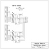

# 74HC595 Servo Drive

By: Cannibal Robot

Language: Spin, Assembly

Created: Dec 11, 2009

Modified: June 17, 2013

Use one cog and 2 54HC595 SIPO's to create a 16 output PWM servo drive using 5 prop ports. This app consists of a SPIN demo program which shows how to start and use the ASM program which drives the servos.
