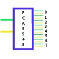

# 8-Channel i2c Switch PCA9548A

By: MacTuxLin

Language: Spin

Created: Feb 13, 2011

Modified: June 17, 2013

TI's 8-Channel i2c Switch with Reset. Allowing you to connect 8 i2c fixed address devices to 1 Propeller using only 2-pins (3-pins if using the Reset pin).
