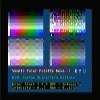

# 80 Column Color 8x8 NTSC Text Driver

By: Doug Dingus

Language: Spin, Assembly

Created: Dec 12, 2009

Modified: June 17, 2013

Version 1.1 fixed color issue.

Versatile 8x8 80 Column Text Driver

136 possible foreground and background colors to take full advantage of specification tolerant displays.

Simple color space to prevent illegal colors, and or out of spec colors. Color = (hue \* 8) + Intensity.

2 color per screen display to run in less HUB RAM.

Vertically Interlaced display option for high quality composite 80 column text.

Live mode switching number of characters, color mode, interlace.

25 row display.

Wide range of horizontal character options for small displays. (8, 16, 32, 40, 64, 80)

Composite NTSC Video.

Object can be easily modified to output S-video, if desired. Just edit VCFG.

Hardware auto detect for quick start. Works on Demoboard, HYDRA, and 96 Mhz HYBRID board.

Modifiable for any clock and video configuration.
