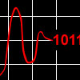

# ADC Input Driver

By: Brandon Nimon

Language: Spin, Assembly

Created: Jul 22, 2009

Modified: June 17, 2013

ADC Input Driver:

Driver for MCP3X0X ADCs. Driver features include support for Microchip ADCs with anywhere between 1 and 8 ADC input channels and resolutions of 16 bits or less. Both single-ended and differential modes are supported. The driver adds support for frequency reading on each of the channels and allows the ADC to react as a programmable Schmitt trigger. Also available is gathering of maximum and minimum or average values of the channels over time. The driver can wait for a channel to achieve a specific state, or can even be put into standby to save power. Channel values and states are available to multiple objects if the driver is supplied with variables to store the information.

Built in is a watchdog timer for any function that takes more than one sample to execute allowing for customizable, time-dependent use.

Known supported ADCs:

MCP3208, MCP3204, MCP3202, MCP3201, MCP3008, MCP3004, MCP3002, and MCP3001
