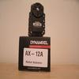

# AX12+ Dynamixel servo driver

By: David Ratcliff

Language: Spin, Assembly

Created: May 4, 2010

Modified: September 11, 2013

This is a driver for the Dynamixel AX12+ digital servos. It now allows all settings including baud rate (7.843k to 1m) to be set. It now allows setting continuous rotation or servo mode. When writing to a 2 byte control register i.e. moving speed, goal position, etc., write the value (up to 11bits) to the first byte address of the 2 byte control register and the program will automatically write the low/high bytes for you when using the writedata method. Example file shows use.
