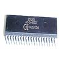

# AYcog v0.8

By: Johannes Ahlebrand

Language: Spin, Assembly

Created: Apr 19, 2011

Modified: June 17, 2013

An emulation of the AY-3-8910/YM-2149F programmable sound generator running in a single cog.

**AYcog v0.8 features:**

*   Runs in one cog
*   Small size
*   125 kHz or better sample rate for "aliasing free" sound generation
*   Full envelope support
*   Envelope tricks works 
*   Can be programmed in the exact same way as a real AY3891X/YM2149F 

(Have a look at the official documentation for a better understanding)

AY-3-8910 and variants were used in:

Homecomputers

*   Amstrad CPC (AY-3-8912)
*   Atari Falcon 030 (YM3439)
*   Atari ST (YM2149)
*   EACA Colour Genie (AY-3-8910)
*   Fujitsu Micro 7 (FM-7) (AY-3-8910)
*   Mitsubishi Multi 8
*   MSX (AY-3-8910)
*   NEC PC-6001 / MK2 / MK2 SR / 6601 (AY-3-8910)
*   Oric 1 (AY-3-8912)
*   Oric Atmos (AY-3-8912)
*   Oric Telestrat (AY-3-8912)
*   Samsung SPC-1000 (AY-3-8910)
*   Sharp MZ5500 (AY-3-8912)
*   Sharp X1 (AY-3-891x)
*   Sinclair ZX Spectrum 128/+2/+3 (AY-3-8912)
*   Timex Sinclair 2068 / 2048 (AY-3-8912)

Sound Cards

*   Applied Engineering Phasor (for Apple II) (AY-3-8913)
*   AY-Magic (for ZX-Spectrum) (AY-3-8910 or YM2149F)
*   Didaktik Melodik (for ZX-Spectrum) (AY-3-891x)
*   EME Sound Box (for Jupiter Ace) (AY-3-8910)
*   HAL GSX-8800 (for PC-8001 and PC-8801) (AY-3-8910)
*   Sweet Microsystems Mockingboard (for Apple II) (AY-3-8913)
*   Sweet Microsystems Sound I (for Apple II) (AY-3-8910)
*   Sweet Microsystems Sound II (for Apple II) (AY-3-8910)

Video Game Consoles

*   Amstrad GX 4000 (AY-3-8912)
*   Bandai Supervision 8000 (AY-3-8910)
*   Elektor TV Games Computer (AY-3-8910)
*   Mattel Intellivision (AY-3-8914)
*   Vectrex (AY-3-8912)

Arcade Systems

*   Irem M-27 (AY-3-891x)
*   Irem M-52 (AY-3-891x): 10 Yard Fight..
*   Irem M-62 (YM-2149): Lode Runner, Spelunker
*   Irem M-63 (AY-3-891x): Atomic Boy, Fighting Basketball..
*   Scramble Hardware (AY-3-8910 x2): Scramble, Amidar..
*   Taito System SJ (AY-3-891x): Elevator Action, Jungle Hunt…
*   many other Arcade PCBs..

_TAGS: Synthesizer, Music, Sound generation, Oscillator, Retro, PSG, Sound chip, Pulse waveform, Square waveform, Noise waveform, Envelope, White noise, Polyfonic synthesizer, Frequency modulation, Frequency synthesis, Amplitude modulation, PWM, Pulse Width Modulation, Sound playback, Sound output, Sound synthesis, Audio playback, Audio generation, Audio output, Signal generation, Game_
