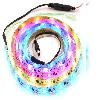

# Addressable_RGB_LED_Strip (TM1804 protocol)

By: Gavin Garner

Language: Spin, Assembly

Created: Apr 25, 2012

Modified: June 17, 2013

This object can be used to easily control an addressable Red-Green-Blue LED light strip (such as the 1m and 2m ones currently available from Pololu.com as parts #2540 and #2541). These strips incorporate TM1804 chips by Titan Micro (one for each RGB LED) and 24-bit color data is shifted into them using very quick pulses (~1300ns=Digital\_1 and ~700ns=Digital\_0). Because these pulses are so quick, they must be generated using PASM code running on its own cog. The advantage to this is that the LEDs can be updated and changed much more quickly than with other types of addressable RGB LED strips – so you can easily create some very cool patterns! (Note that this code will not control RGB LED strips that use WS2801 chips such as the ones currently being sold by Sparkfun.com. There is another object available on the OBEX posted by tubular that can control these slower protocol strips directly using a little Spin code.) I have included a demo that performs a quick light show and has lots of comments to get you started as you create your own. Have fun!
