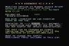
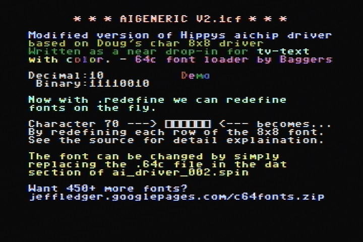
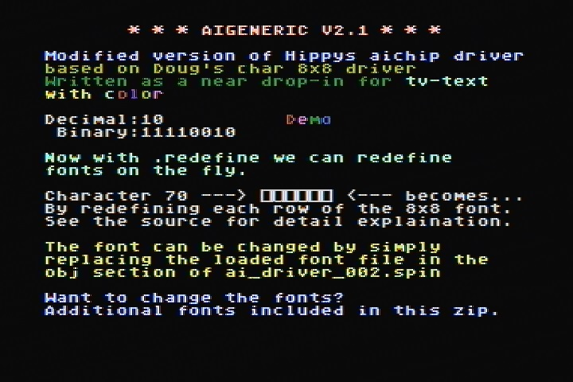

# AiGeneric Text Driver

By: Jeff Ledger

Language: Spin, Assembly

Created: Mar 31, 2009

Modified: June 17, 2013

**Multifont AiGeneric TV Text Driver 40x24.**

This text driver is a collaborative work created by the following programmers:

*   Doug Dingus (Potatohead)
*   Hippy
*   Jim Bagley (Baggers)
*   Jeff Ledger (Oldbitcollector)

Most "TV\_Text" commands are supported by this driver, in addition, positional commands, character redefiniton, character color, and the ability to load Commodore 64 (.c64) fonts.

  

**This archive contains the following:**

*   AiGeneric 2.1 TV Text Driver (Supports Spin Font Files created by Font Generator {included}.)
*   AiGeneric 2.1CF Text Driver (Supports use of .c64 font files.)
*   Font Generator (converts a .bmp image to a usable Spin font file.)

Additional .c64 font files can be downloaded from: http://jeffledger.googlepages.com/c64fonts.zip

