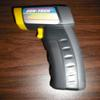

# All-Sun Infrared Thermometer Driver

By: DogP

Language: Spin

Created: May 18, 2010

Modified: June 17, 2013

This demonstrates reading object temperatures with an All-Sun (http://www.e-sun.cn/) EM520B infrared thermometer.  This has been tested with one rebranded as CEN-TECH #96451 (8:1 distance to spot, plus laser), from Harbor Freight.  There are several models similar to the EM520B, with slightly different specs which may also work, though it's completely untested as I don't have access to any of them.

This communicates using 5V TTL RS232. There are 4 pins accessible by removing the battery cover, and the battery orientation label above the battery. The pins are on a 2mm header, though I opened the case and soldered a standard 0.1" header to the 2mm header for easier testing.

The pins are labeled:

*   INIT: Unsure, some initialization pin, likely for factory testing (screen momentarily displays Conn when grounded)
*   RX: Receive
*   GND: Ground 
*   TX: Transmit

Since the RS232 pins on the thermometer are 5V, you must add a series resistor on the TX pin (4.7k or so). This demo connects it to pin 3. Ground must be connected to Vss. The other two pins can be left unconnected.

To take readings, press the trigger on the thermometer. This demo constantly listens for new data on the RS232 Rx pin and displays the object temperature to the debug RS232 port. I haven't been able to find any good documentation on this device, so I don't know of any commands to send to it. I also only reverse engineered the message enough to know the start of the message, the object temperature, and the checksum. There are quite a few bytes of data that aren't decoded in these messages.

_See forum post for more info/pics: http://forums.parallax.com/forums/default.aspx?f=25&m=453982 ._
