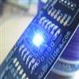

# Allegro MicroSystems A6281 3-channel LED Driver

By: Timothy D. Swieter

Language: Spin, Assembly

Created: Apr 10, 2009

Modified: June 17, 2013

This driver is for running a daisy chain of Allegro MircoSystems A6281. Th A6281 IC is a three channel, 10-bits per channel LED driver. The Brilldea PolkaDOT product series uses the A6281 LEDs and red, green, blue (RGB) LEDs. More information about PolkaDOTs is available at http://www.brilldea.com/.

Included in the zip file is the driver and a demo of how to use the driver. If you have questions or a recommended improvement, let me know through a PM on the Parallax Forum.
