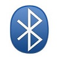

# BlueSmirf Bluetooth serial port, with Bluetooth device discovery, listing and pairing

By: Mathew Brown

Language: Spin

Created: Mar 8, 2014

Modified: March 8, 2014

Allows for discovery, and connection to serial over Bluetooth using BlueSmirf Bluetooth Modem hardware

Methods included for returning a list of discovered devices, and pairing with a bluetooth device by "name"       
     
 Has method dependencies & calls to FullDuplexSerial, for host comms for bluetooth modem configuration.          
 Additionally, includes "pass through" low-level serial methods, for native port access

  
 Requires 1 cog for serial driver

Also has method dependencies & calls to "StringBuilder", for low level string assembly, through

character, or "string to be appended" concation
