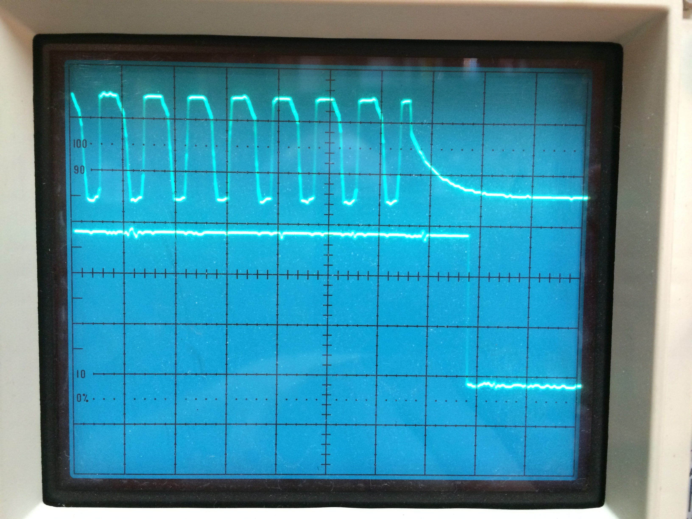

# Brownout Detector To Save Variables to EEPROM

By: DDS

Language: Spin, Assembly

Created: Mar 27, 2013

Modified: August 15, 2014

This PASM program constantly measures the pulse width of a 60-Hz clipped signal from a power transformer. This transformer is used to power the propeller circuit. In the event of a power loss (1st lost cycle) or simply turning off the power, the brownout detector clears a variable to 0, signaling your SPIN program to save it's variables to EEPROM memory before losing power. I have included a small demo program to show how I use it. The revised program returns the line frequency of the 60-hz power as a value close to 666\_666 = (80\_000\_000/120Hz)

