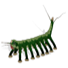

# CD4067

By: MacTuxLin

Language: Spin

Created: Apr 4, 2013

Modified: April 4, 2013

TI's 16-Channel CMOS Analog Multiplexers / Demultiplexers - CD4067B. Using 6 Prop1 pins to connect to Inhibit, Common In/Out & 4 binary control inputs, you can control 16 outputs & inputs with only 3 functions in Spin:

CD4067\_Send(Channel) = Send a High signal to intended channel#

CD4067\_Read(Channel) = Read a channel#'s pin status. 1 for high, 0 for low

CD4067\_Off = Switch off all channels.
