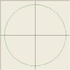

# Circular Interpolation for CNC or Graphics

By: DDS

Language: Assembly

Created: Apr 4, 2013

Modified: April 4, 2013

This code generates a circular interpolation motion profile as intended for a home-brew CNC machine. (CNC Codes G02 & G03)

I use Bresenham's algorithm calculates X & Y steps to accurately approximate a circular path.

The code will calculate arcs starting and ending in any quadrant.

I have not implemented a controlling feed rate so it is just a starting point.
