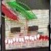

# Color Organ

By: lyassa

Language: Spin

Created: Mar 29, 2013

Modified: April 26, 2013

Digitize audio signal and display the audio level on 24 LEDs. Uses mcp3208 ADC to read the audio input and ULN2803 to drive the LEDs.

Contents of zip file:

*   colorOrgan.spin
*   colorOrgan.pdf
*   color\_organ.wmv
*   colorOrgan2.wmv. 

Display audio level in dot mode, bar mode and multiple Leds mode. It can be fun to try to come up with more patterns.
