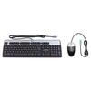

# Combo PS2 Keyboard and Mouse Driver

By: Kwabena W. Agyeman

Language: Spin, Assembly

Created: Apr 4, 2013

Modified: April 18, 2013

A combo PS2 keyboard and mouse driver that runs on one cog. The code has been fully optimized with a super simple spin interface for maximum speed and is also fully commented.

Provides full support for:

*   Getting the state of any of the 104 keys on the keyboard,
*   Getting the state of the scroll lock light/function,
*   Getting the state of the number lock light/function,
*   Getting the state of the caps lock light/function,
*   Getting the mouse bounded X position,
*   Getting the mouse bounded Y position,
*   Getting the mouse Z position,
*   Getting the mouse left button state,
*   Getting the mouse right button state,
*   Getting the mouse middle button state,
*   Getting if a keyboard is attached,
*   Getting if a mouse is attached,
*   Setting the keyboard typematic delay and typematic repeat,
*   Setting the mouse resolution and scaling,

This driver creates and stores keyboard events whenever a key is pressed or released on the keyboard. Each keyboard event contains information on the state of the keyboard when the event happend and information on what event happened. This driver has a 256 event keyboard queue.

Below are things that can be extracted from keyboard events:

*   The windows modifier state during that event,
*   The alternative modifier state during that event,
*   The control modifier state during that event,
*   The shift modifier state during that event,
*   The caps lock modifier state during that event,
*   The number lock modifier state during that event,
*   The scroll lock modifier state during that event,
*   The make or break state of the key causing the event,
*   The printable nature of the key causing the event,
*   The key causing the event,

This driver creates and stores mouse events whenever a button is pressed or released on the mouse and whenever the mouse is moved. Each mouse event contains information on the state of the mouse when the event happend and information on what event happened. This driver has a 256 event mouse queue.

Below are things that can be extracted from mouse events:

*   Was the left button pressed,
*   Was the left button released,
*   Was the right button pressed,
*   Was the right button released,
*   Was the middle button pressed,
*   Was the middle button released,
*   Was the mouse moved in the X direction,
*   Was the mouse moved in the Y direction,
*   Where the mouse X position was when the event happend,
*   Where the mouse Y position was when the event happend,
*   Where the mouse row position was when the event happend,
*   Where the mouse column position was when the event happend,
*   Was the mouse X position between certain pixel bounds,
*   Was the mouse Y position between certain pixel bounds,
*   Was the mouse row position between certain bounds,
*   Was the mouse column position between certain bounds,
