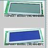

# Controlerless graphic LCD driver T6A39/T6A40

By: Alex Pirvulescu

Language: Spin, Assembly

Created: Apr 4, 2013

Modified: April 4, 2013

Controler-less Toshiba graphic LCD driver (4-pin)

Basic graphic routines (point, line, circle) and 8x8 font text handling.

This if for displays that have T6A39 for columns and T6A40 for lines, without any controller (T6963C).

Update 1.1

PASM pixel and char display (taken from Graphics.spin)

Added color "2" - XOR

Now we have "0" - ANDN, "1" - OR and "2" - XOR
