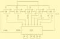

# Declarative Finite State Machine Runner

By: Chris Cantrell

Language: Spin, Assembly

Created: May 6, 2015

Modified: May 6, 2015

Managing state transitions in a large event-driven state machine application can be tedious. Often it is easier to define the states and transitions declaratively -- in a list or table.

The FSMRunner parses a state machine declaration defined in a data (DAT) section and calls out to user functions as needed. You write your support functions in SPIN and describe the state transitions in the table. The FSMRunner ties the two together.

The archive includes a "25 cent soda machine" simulator. Use the serial terminal to put in nickels, dimes, and quarters. The state machine keeps up with your total input and lets you have a soda when the price is right.

You can also see the state machine runner in action in Propeller Tic Tac Toe here:

https://www.youtube.com/watch?v=3dLgyH8NW6o

This runner (and the Tic Tac Toe code) is part of my state-machine work on GitHub here:

https://github.com/topherCantrell/StateMachines
