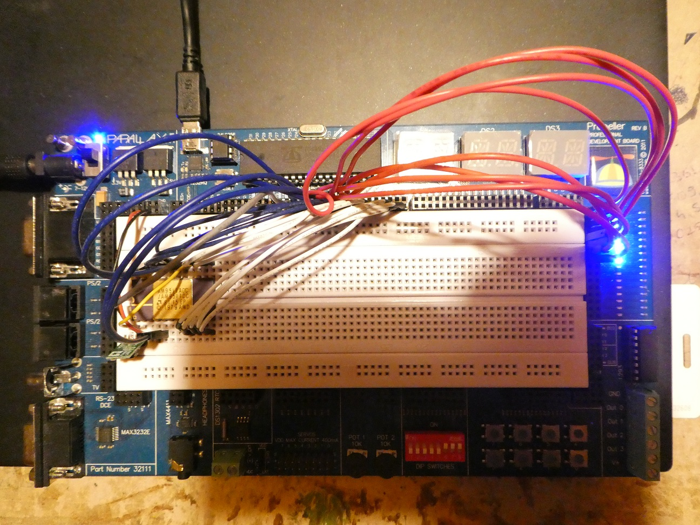

# Driver for AMD Am9511A Arithmetic processor (vintage 8-bit floating point coprocessor)

By: Zoltan Pekic

Language: Spin

Created: Dec 30, 2018

Modified: December 31, 2018

Bringing vintage chips back to life is lots of fun and great learning experience too. One of the most fascinating is Am9511A which 40 years ago allowed 8-bit CPUs an order of magnitute faster floating point calculations. Lots of info can be found about this chip, here is one source:

http://ep.homeserver.hu/PDF/AM9511A-9512.pdf

The zip includes 2 files:

**am9511.spin**

The object to drive the FPU. It takes 1 cog to run. The basic idea is simple: run the cog in a loop driving all the required FPU signals. The communication with the main object happens using a common memory, which is 6 longs in main RAM:

1st long: 4 bytes containing 4 operations to be executed sequentially

2nd - 5th longs: 4 values to pass in (push) or out (pop) from the FPU

6th long: 4 bytes containing 4 status codes, matching the operations in 1st long

After the main object initializes the common memory, the FPU operates in parallel until it executes all 4 operations. Longer "queues" could be implemented, but that would require a lock, whereas in this simple solution 1 long containing 4 operations cannot be read/written by main and object cog simultaneously, giving it a simple way to avoid update collisions.

There are 2 main "worker" methods exposed:

StartEval - blocks until previous calculation by the FPU finishes. When it does, it initializes the shared memory with 6 longs to kick off new operations and supply them with values, plus return the status of the previous calculation.

AwaitEvalStatus - blocks until previous calculation by the FPU finishes, and when it does return the status. This is useful if code in the main cog relies on the result from FPU. Just executing that code might pick up values from shared memory before all calculation is done. Note that if another StartEval is needed, that method will handle it properly, so for example in loops AwaitEvalStatus may not be needed, but when exiting a loop typically yes, to wait for the last StartEval to finish.

**test\_am9511.spin**

This is the top level file driving the am9511 object and illustrating the way how to use it. After intitializing the FPU and displaying some well known values (e, pi, etc) to check if it works correctly, it runs 2 algorithms:

\- sum of sin(x)^2 + cos(x)^2 for degree angles 0 ... 359. Obviously the sum of this should be (around) 360, which is printed out

\- factorial in floating point numbers for 20 (21 causes overflow)

Both of these are run using the FPU and Float32Full floating point library to compare the cycles used. Turns out that the Float32Full being written mostly in Propeller assembly is devilishy fast and at 80MHz beats a 4MHz Am9511A by a factor of 20 or so. However, this could probably be lessened by a better implementation of am9511 spin object. 

**Hardware:**

I used the Propeller prototype board, but any other should do fine too. The pin connections are indicated in the am9511.spin code. There are few important things to note:

\- Am9511A uses +5V and +12V. The latter needs little current so any of the voltage boosters can be used 

\- Code must be changed to match the speed of the FPU, which comes in 2, 3, and 4MHz versions.  It is currently set at 2.2MHz which should be a safe "overclock".

\- These chips are not "static" - they require some minimal clock frequency to keep the state

I hope somebody will find this useful for some cool project!

The code is also here: https://github.com/zpekic/am9511

