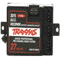

# Dual RC Servo Pulse Width Measurement Driver

By: Kwabena W. Agyeman

Language: Spin

Created: Apr 5, 2013

Modified: April 5, 2013

A dual RC servo controller interface object that runs in one cog. The code has been fully optimized with a super simple spin interface for maximum speed and is also fully commented.

Provides full support for:

*   Getting the current pulse width length measurement being sent to the left channel.
*   Getting the current pulse width length measurement being sent to the right channel.

Ajusting automatic zeroing of each channel when inactive. Good for interfacing with different RC controllers.
