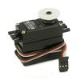

# Dual Servo Driver

By: Kwabena W. Agyeman

Language: Spin

Created: Apr 5, 2013

Modified: April 5, 2013

A dual servo driver that runs in one cog. The code has been fully optimized with a super simple spin interface for maximum speed and is also fully commented.

Provides full support for:

*   Setting the pulse length for the left servo.
*   Setting the pulse length for the right servo.

Ajusting the update frequency. Good for interfacing with non-standard servos.
