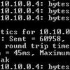

# ENC28J60 Ethernet PHY/MAC Chip Driver

By: Harrison Pham

Language: Spin, Assembly

Created: Apr 5, 2013

Modified: April 5, 2013

Changes

*   11/12/2007 - Fixes packet send hang bug.
*   12/28/2007 - Released under Obex compatible license.
*   10/06/2009 (4.0) - Added PASM checksum code, 20MHz SPI, massive speed improvements.
*   12/07/2009 (5.0) - Removed packet array, the user app is now expected to supply a pointer to a predefined array. Default MAC address is now a locally assigned address (02-....).

This driver provides an easy to use API for communicating with the ENC28J60 chip without worrying about all the register configurations and SPI requirements associated with the chip. This driver also provides a 25mhz clock signal to the ENC28J60 if the user does not have access to a 25mhz crystal.

Beta versions can be obtained at http://harrisonpham.com/dp/proptcp
