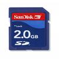

# FAT16/32 Full File System Driver

By: Kwabena W. Agyeman

Language: Spin, Assembly

Created: Mar 27, 2013

Modified: May 7, 2013

**A FAT16/32 full file system driver that runs on one cog.  The code has been fully optimized with a super simple spin interface for maximum speed and is also fully commented.**

Provides full support for:

Mounting and unmounting FAT16 or FAT32 partitions on Secure Digital Cards (SD Cards) and Multi-Media Cards (MMC Cards).

Any mounted FAT16 or FAT32 partition can be queried for its count of clusters, total sectors, sectors per cluster, bytes per sector, used sector count, free sector count, file system type, volume label, volume identification number, and disk signature number.

All files and folders on the mounted FAT16 or FAT32 parition can be queried for their name, size, creation day, creation month, creation year, creation second, creation minute, creation hour, last access day, last access month, last access year, last modification day, last modification month, last modification year, last modification second, last modification minute, last modification hour, read only status, hidden status, system status, directory status, and archive status.

Additionally, there is support for changing directories, changing file or directory attributes, moving and renaming files or directories, deleting file or directories, making new files, and making new directories. By default all functions accept file system paths as arguments.

All files on the partition can be opened in read, write, or append mode. Byte/short/long reading/writing are supported on any open file. Additionally string reading/writing and block reading/writing are supported on any open file. File seek, file tell, and file size are also supported for any open file.

Ontop of that, formating any parition on the SD card is supported and rebooting from any valid .bin or .eeprom file on the SD card is supported.

Finally, card detect and write protect logic is built into the file system. A time stamp system using a real time clock is also supported.

This driver supports the FAT file system specification to the letter. The file system is locked by individual cogs per access and supports multiple files open by including multiple copies of the object.

*   File Byte Reading Speed - 3KBs
*   File Byte Writing Speed - 3KBs
*   File Short/Word Reading Speed - 6KBs
*   File Short/Word Writing Speed - 6KBs
*   File Long Reading Speed - 13KBs
*   File Long Writing Speed - 12KBs
*   File Sector (512 Bytes at time) Reading Speed - 241KBs
*   File Sector (512 Bytes at time) Writing Speed - 110KBs

This list of features is not comprehensive. Please download the source code and run the included demo to gain a better understanding of this driver.

Please vist http://www.parallaxsemiconductor.com/an006 for more info.
