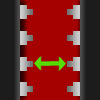

# Fast Inter-Propeller Communication

By: Brandon Nimon

Language: Spin, Assembly

Created: Apr 5, 2013

Modified: April 5, 2013

Fast Inter-Propeller Communication:  
Quickly transmit information between two different Propellers.

Outputs at 8.80 million bits per second at 80MHz (over 1MB/s), including overhead. This ends up being more than 270K longs every second. Transferred at bursts of 10Mbaud.

Transmission methodology puts one high start cycle, and after each long (while the next long in the buffer is being retrieved) line will remain low as a stop bit. After entire buffer is sent, the cog waits for an acknowledge bit on the same line.

Watchdogs are optional methods to ensure lockups don't occur if the ACK bit (for TX) or data (for RX) is never received.
