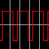

# Frequency Synthesis/PWM X8

By: Brandon Nimon

Language: Spin, Assembly

Created: Apr 9, 2013

Modified: April 9, 2013

Frequency Synthesis/PWM X8:  
This program grants the ability to output up to eight (8) frequencies at once using the resources of only a single cog. The program could be easily modified to support more outputs if necessary.

With a clock speed of 80MHz, single outputs can stably reach as high as 842KHz. The use of higher clock speeds can increase the maximum output. If more than one output is used (the main purpose of this program), the maximum frequencies depend on the amount and combination of frequencies and duty.

The duty can be changed to alter the ratio of high to low output (PWM). The duty value is a percentage, and applies to all outputs. A duty of 1% - 99% is supported.

If a output is not needed, just enter -1 for the pin or 0 for the frequency.
