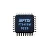

# FullDuplexParallel

By: Terry E Trapp, KE4PJW

Language: Spin, Assembly

Created: Apr 9, 2013

Modified: April 9, 2013

This is the FullDuplexParallel object v1.0. It is based on the FullDuplexSerial object v1.1 from the Propeller Tool's Library folder with modified documentation and methods for converting text strings into numeric values in several bases. It interfaces the propeller with the FTDI FT245 Parallel FIFO. The FTDI FT245 allows for high performance I/O to a PC.
