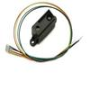

# GP2D02 Infrared Distance Sensor Driver

By: Kwabena W. Agyeman

Language: Spin, Assembly

Created: Apr 9, 2013

Modified: April 9, 2013

GP2D02 infrared distance sensor driver. The code has been fully optimized with a super simple spin interface for maximum speed and is also fully commented.

Provides full support for:

1.  Getting the raw distance reading from the sensor.
2.  Getting the linearized distance reading from the sensor.
