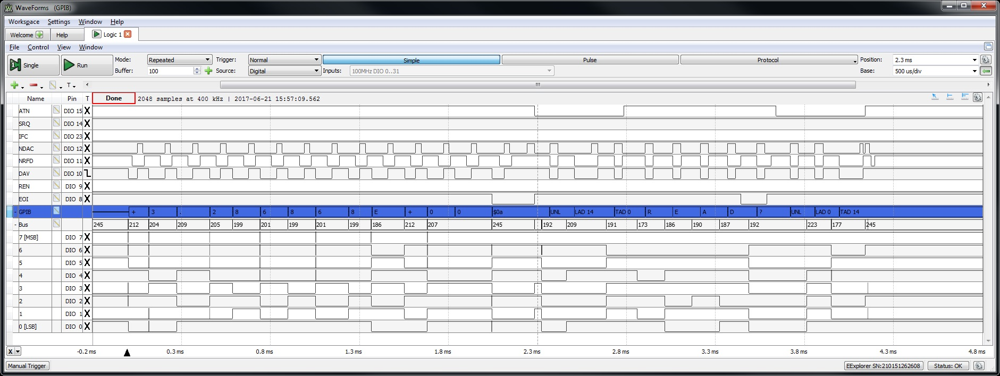

# GPIB driver

By: Chris Gadd

Language: Spin

Created: Dec 1, 2018

Modified: December 1, 2018

  Spin-based GPIB driver, capable of ~6KBps -- largely dependent on instrument capability

  Communication is always between the Propeller and one other instrument at a time

   Transmitted messages are in the form of text strings

   Received messages are stored in a byte array, local to this object

  This GPIB driver has been tested on multiple instruments, including the Keithley 6512 and 6514 Electrometers, LeCroy WaveRunner oscilloscope,

   Leader LCR-745G, HP8116A Pulse Generator, and HP5334B and HP5335A Universal counters.

  This object is intended to be shared by all GPIB instruments, each instrument has access to the same shared registers

