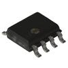

# Generic I2C EEPROM Driver

By: Kwabena W. Agyeman

Language: Spin, Assembly

Created: Mar 28, 2013

Modified: March 28, 2013

A generic I2C EEPROM driver. The code has been fully optimized with a super simple spin interface for maximum speed and is also fully commented.

Provides full support for:

*   Reading a byte from the EEPROM,
*   Writing a byte to the EEPROM,
*   Reading a word from the EEPROM,
*   Writing a word to the EEPROM,
*   Reading a long from the EEPROM,
*   Writing a long to the EEPROM,
*   Reading an arbitary page from the EEPROM,
*   Writing an arbitary page to the EEPROM,

Uses 19 bit addressing to allow reading and writing on multiple EEPROMs sharing the I2C that have different device addresses.

Supports locking of the I2C bus to support multiprocessor access.
