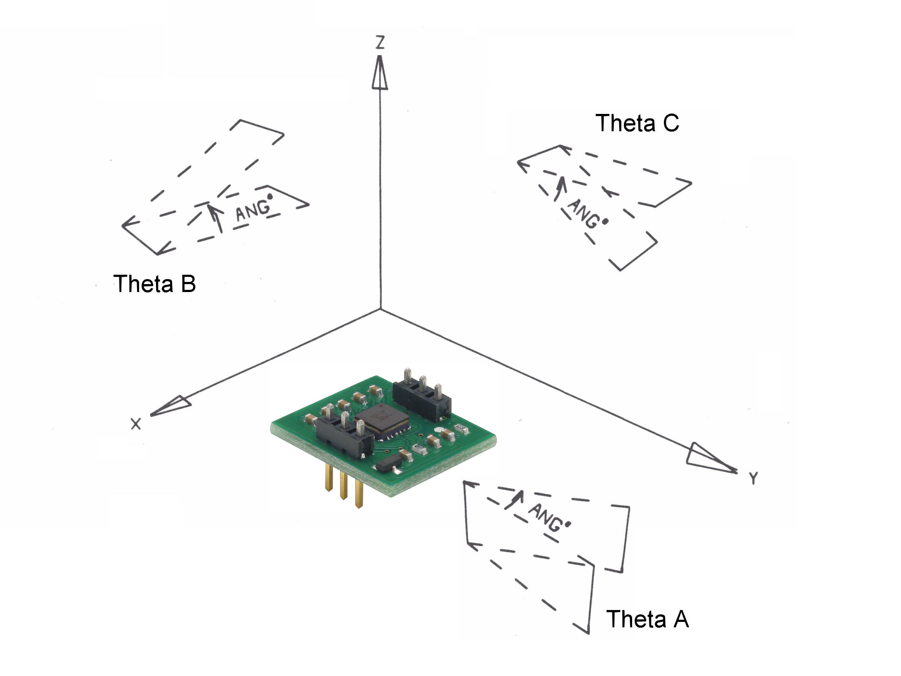

# H48C Tri-Axis Accelerometer DEMO

By: Parallax Inc

Language: Spin

Created: Jan 22, 2015

Modified: January 22, 2015

Interface to the H48C Tri-Axis Accelerometer. The included demo displays orientation information on a VGA monitor.

Revision History:

*   Version 1.0 - (Sept. 2006)
    *   Initial release with a TV mode 3D graphics cube
*   Version 1.1 - (March 2008)
    *       3D-graphics cube removed
    *       Basic VGA display used instead of TV
    *       Added 600nS padding delay around Clock rise and fall times

