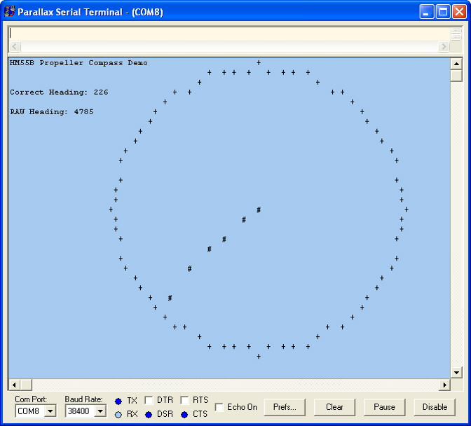

# HM55B Compass Module TV and Serial DEMO

By: Parallax Inc

Language: Spin

Created: Jan 22, 2015

Modified: January 22, 2015

Demonstrates the use of the HM55B Compass module.

*   Version 1.0
    *   (09/11/2006) Initial release
*   Version 1.1
    *   (02/09/2008) Fixed sign detection at improper bit location
*   Version 1.2
    *   (01/12/2008) Added calibration scheme - This demo shows the RAW heading with a "RED" compass arrow, along with the Correct heading after calibration with a "YELLOW" arrow on a TV display.
*   Version 1.3
    *   (02/06/2008) Partitioned calibration scheme into separate Add-on program. This modular approach makes it easier to use in other applications without being wrapped up in the demo.
*   Version 1.4
    *   (03/24/2009) Calibration values displayed for easier interpolation

Note: The Serial version uses DEBUG graphics to draw a compass (see screenshot under Auxillary files)

