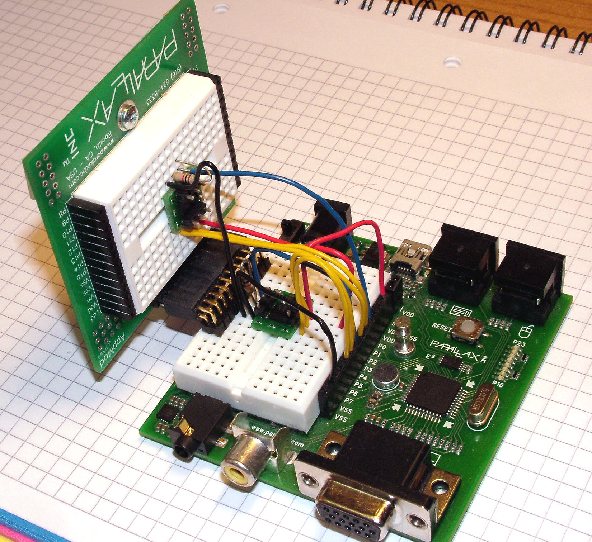

# HM55B Dual Compass Driver

By: I.Kövesdi

Language: Spin, Assembly

Created: Apr 9, 2013

Modified: April 9, 2013

This PST application uses the HM55B\_Dual\_Driver object. This dual SPI driver object can control two HM55B 2-axis compass modules that may form a 3-axis magnetometer unit. The driver can be used in a single sensor setup, as well. It needs only one additional COG for its PASM code for both sensors.

