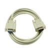

# Half Duplex Serial Port Driver

By: Kwabena W. Agyeman

Language: Spin

Created: Apr 9, 2013

Modified: April 9, 2013

An half duplex serial port driver. The code has been fully optimized with a super simple spin interface for maximum speed and is also fully commented.

Provides full support for:

*   Receiving bytes,
*   Receiving words,
*   Receiving longs,
*   Receiving strings,
*   Transmitting bytes,
*   Transmitting words,
*   Transmitting longs,
*   Transmitting strings,

Baud Rate from 1 BPS to 19,200 BPS @ 96 MHz - Half Duplex.
