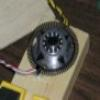

# Hard Disk Drive Motor (BLDC) Driver

By: Paul Rowntree

Language: Spin

Created: Apr 9, 2013

Modified: April 9, 2013

This code provides a simple way to control a brushless spindle motor (such as found in hard disk drives) at rotational speeds up to 120 Hz, with good stability, control, acceleration and torque. The ZIP file includes a description with photos, wiring schematics, CorelDraw and PDF versions of the encoder wheels used, and of course the code. It is bundled with Hanno's ViewPort Conduit (v4.1.1), which has been renamed to avoid conflicts in you file systems.
