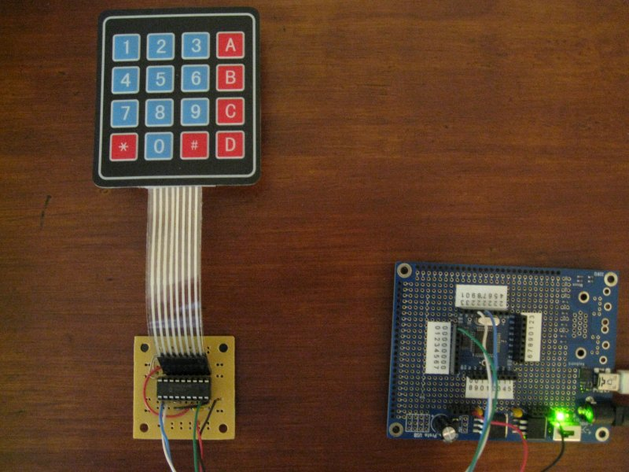

# I2CKeypad

By: Ron Czapala

Language: Spin

Created: Jul 2, 2014

Modified: July 2, 2014

This object uses the Interrupt-On-Change feature of the Microchip MCP23008 I/O Expander chip to interface a 4x4 Matrix Keypad (Parallax #27899) to a propeller MCU.

When a key on the keypad is pressed, the MCP23008 goes LOW and the propeller scans the rows and columns to determine which key is pressed.

Then it clears the interrupt as the key is released.

See Microchip's Application Note: AN1081

