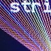

# ILI9320 320x240 TFT driver

By: MarkT

Language: Spin, Assembly

Created: Apr 9, 2013

Modified: April 9, 2013

ILI9320 320x240 TFT driver with simple graphics support (dot/line/rect/characters).

Supports 8=bit parallel mode for the ILI9320 as on the TechToys TY240-240320-B0 display.
