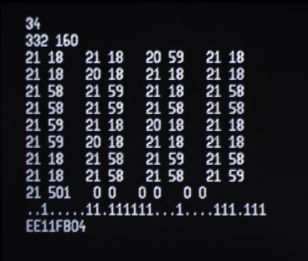

# IR Kit

By: Bob Belleville

Language: Spin

Created: Apr 10, 2013

Modified: April 10, 2013

IR Kit contain objects to get and buffer key codes from virtually any IR remote, identify and obtain timing information, transmit IR codes, and understand IR transmission codes. (IR\_kit.zip)

