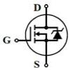

# IR2101PWM

By: Eric R

Language: Spin, Assembly

Created: Apr 10, 2013

Modified: April 10, 2013

Motor driver using two IR2101 driver chips from International Rectifier. These chips drive an H bridge made with MOSFETS or IGBTs. For driving DC permanent magnet motor or other inductive DC load. After driver is started writing a "duty cycle" value of -4000 to 4000 to a long variable creates nearly full negative and nearly full positive voltage output. Duty cycle may be commanded by a Spin or an Assembly program.
