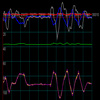

# Kalman Filtered IMU via 5DOF Accelerometer/Gyro

By: Jwood

Language: Spin

Created: Apr 10, 2013

Modified: February 6, 2017

This object uses an ADC to take readings from a 5DOF Accelerometer/Gyro unit and send them through a Kalman filter. This filter maintains an accurate angle, gyro rate and gyro bias based on the noisy readings. Hook up the MCP3208 ADC to the 5DOF circuit like the object shows. Then start up the filter. After that use the reading for balancing a robot or flying an aircraft.

update: Fixed a few bugs and set the correct stackspace (with a little extra)

update: Added 2 axis. You now use these functions: get\_angle\_pitch, get\_angle\_roll, get\_rate\_pitch, get\_rate\_roll, get\_q\_bias\_pitch, get\_q\_bias\_roll
