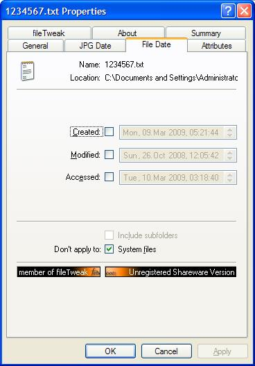

# Kermit EEPROM Console

By: Eric R

Language: Spin, Assembly

Created: Mar 28, 2013

Modified: April 10, 2013

This serial driver allows loading of programs wirelessly to EEPROM, with the Kermit protocol. Tested on XBee in transparent mode. Requires a program such as Hyperterminal (PC) or ZTerm (Mac) to send the file. Also implements a command line interface. Program loading not real fast, takes about 1.5 minutes to load a 32K .eeprom file. Also allows printing to the serial connection for logging, etc. 'Extra' files have VGA debug display version and command parser routine.

