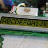

# LCD Driver for HD44780/KS0066

By: Ding-Batty

Language: Spin

Created: Apr 10, 2013

Modified: April 10, 2013

Object: LCD\_Ding\_Batty version 1.3 -- 14-Nov-2010

This is a layered LCD driver for the various parallel-interface character LCD displays (and some VFDs) with a control interface compatible with the HD44780 command set,  
implemented strictly in Spin.

The base driver object simply provides command and data transfers with the display, and handles the low-level I/O (4-bit or 8-bit interface, direct or indirect) and display initialization. The higher-layer driver is configured for a specific display unit: number of lines and columns, etc., and is independent of the actual low-level hardware interface.

The driver is full-function, and after initialization contains no timed-delays (except for one hardware quirk work-around for the Clear operation). It includes support for user-defined characters, and the demo includes a "spinning hourglass" example.

The version 1.0 release contained:

*   Base driver for 4-bit, direct I/O pin interface, with test/demo program
*   Driver object for a 16x1 display, managed as two 8x2 segments, with test/demo program

Update: 24-Sep-2010: Version 1.1 uploaded to ObEx

Changes:

*   Now has 20x4 LCD driver, with test/demo program
*   Now has 20x4 VFD driver (different memory use than the HD44780 LCD controller), with test program.

Update: 24-Oct-2010: Version 1.2 uploaded to ObEx

Changes:

*   Now has Nx2 LCD driver for most two-line displays, with test/demo program
*   Small modifications to the base driver for some timing issues
*   Small modification to the 16x1 driver, to make it easier to modify for other widths (such as 24x1).

Update: 14-Nov-2010: Version 1.3 uploaded to ObEx

Changes:

*   Added Base driver for 8-bit, direct I/O to the display board.

Plans for future versions of this driver set (but probably not in the "near future"):

*   additional low-level drivers: 4-bit through an I/O expander (which I expect I will need to minimize Propeller I/O pin use);
*   More fun demo programs.
