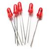

# LED Driver

By: Kwabena W. Agyeman

Language: Spin

Created: Apr 1, 2013

Modified: April 10, 2013

A light emitting diode driver. The code has been fully optimized with a super simple spin interface for maximum speed and is also fully commented.

Provides full support for:

*   Changing the light emitting diode's frequency. 
*   Changing the light emitting diode's brightness.
