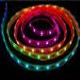

# LPD8806

By: Alamorobotics

Language: Spin, Assembly

Created: Apr 10, 2013

Modified: April 10, 2013

This is a driver for the LED Strip from adafruit.com  
https://www.adafruit.com/products/306

I took the source code for the Arduino and reversed engineered it to figure out the timing and latching.  
My first try in Spin didn't go to that well, the performance of Spin was not even close to what was needed.  
So I took the 74HC595 driver from Dennis Ferron and modified it to shift out the data for the LPD8806.
